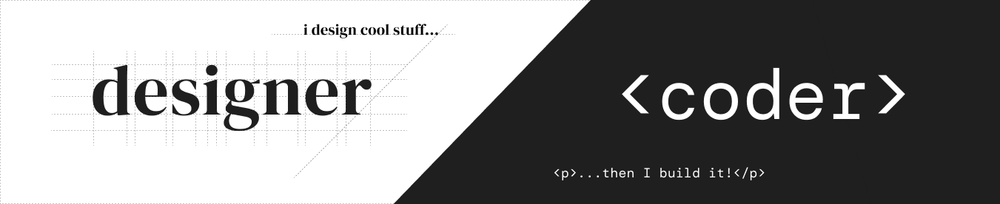

# Hi, this is Ahmet! 

> _I'm an aspiring Front End Engineer._

Welcome and thanks for taking the time to visit my domain!

Having studied Visual Communication Design in college and being thrown in the world of agencies I’ve quickly realized **_nothing excites me more than my designs coming to life through the hands of a good developer_**.

That admiration turned into curiosity and that curiosity took me back to the drawing board and to this portfolio right here. Hope you like what you see!

## STACK

### ⌨ Programming Tools

### 🎨 Design Tools

